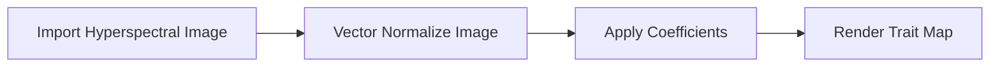

<h1 align="center">Part 3 - Foliar Trait Mapping</h1>

by: Kyle Kovach, Zhiwei Ye, Henry Frye, Phil Townsend
   
   

  
  
  
  

## About This Tutorial

We're happy you're here!  This tutorial is for the application of the foliar functional trait model coefficients to hyperspectral imagery.

## What will you do here:
1. Import this Github repository into your local working environment
2. Import the hyperspectral image tile into the **Data** folder of your newly downloaded and created repository.
3. Startup an instance of Jupyter Notebook
4. Edit the code line for the specific hyperspectral image file name.
  4a. _(Optional)_ Edit the code line for the specific coefficient model file name.
6. Execute the code line-by-line in Jupyter Notebook to produce the foliar trait map.
7. Visualize the results

## What the code is actually doing:
1. Loads the hyperspectral image you specify
2. Brightness normalizes the spectral bands by vector normalizing (we'll explain)
3. Applies the trait coefficients per band
4. Renders the image

## Why this is important:
Foliar traits are interesting when predicted with spectroscopy to derive specific numeric values, but often, visualizing the trait maps can offer insights into spatial patterns.

## Credits
Thank you to the NASA JPL and GSFC teams, as well as the ORNL DAAC and the University of Cape Town!

[![Python][python-shield]][python-url]

<!-- MARKDOWN LINKS & IMAGES -->
[python-shield]: https://img.shields.io/badge/Made%20with-Python-1f425f.svg
[python-url]: https://www.python.org
